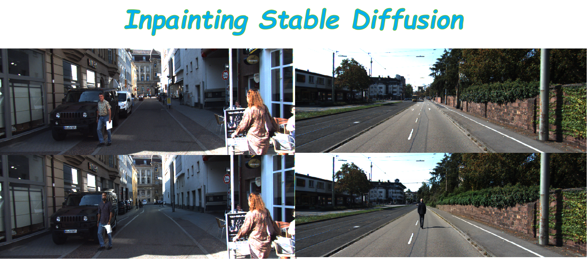

Welcome to the Fooocus Inpainting Interface, featuring the cutting-edge Fooocus generative model designed for image inpainting. This interface simplifies the process of integrating human figures into images, offering a straightforward function-based approach for users.

# Fooocus Inpainting Interface

### Getting Started

To dive into the world of advanced image inpainting, follow these steps to set up your environment:

1. **Environment Setup**: Create and activate a new Conda environment:

   ```
   bashCopy codeconda env create -f environment.yaml
   conda activate fooocus
   pip install -r requirements_versions.txt
   ```

   After installation, run `python entry_with_update.py`. You may ignore the output and any browser window that appears; our interface handles port connections internally.

2. **Launch the Demo**: Simply execute `python demo.py` to see the inpainting in action.

### Embedding Fooocus in Your Projects

Integrating Fooocus into your projects is effortless. Here's how you can do it:

```
import insert_human

# Assume img and mask are your predefined image and mask arrays(np.uint8)
img, mask = ..., ...
img_inpainting = insert_human(img, mask)
img_inpainting = Image.fromarray(img_inpainting)
img_inpainting.save('./img_inpainting.png')
```

You can adjust the size of the generated elements in your images by modifying the mask size used in the inpainting process.

### Customizing Your Inpainting Prompts

Tailor the inpainting process to your needs by modifying the task template:

1. The `task_template.pkl` file contains a list of arguments used by the Fooocus Inpainting model. To change your prompt:

   ```
   import numpy as np
   import pickle
   
   with open('./task_template.pkl', 'rb') as file:
       arg_template = pickle.load(file)
   
   # Update the prompt here
   arg_template[1] = 'a man on the street.'
   
   with open('./task_template.pkl', 'wb') as file:
       pickle.dump(arg_template, file)
   ```

### Some results

To give you a clearer idea of the transformation possible with the Fooocus Inpainting Interface, below are examples showcasing the original images alongside their inpainted counterparts. This comparison highlights the interface's ability to seamlessly integrate human figures into existing scenes, enhancing the overall composition and realism of the images.

#### Original Image vs. After Inpainting:

##### Original Image


##### After Inpainting

##### Original Image

##### After Inpainting

##### Original Image

##### After Inpainting

### Batch Processing for Customized Datasets

If you're looking to apply inpainting to your own dataset in batch mode, the process is straightforward:

1. **Configure Your Dataset Directory**: In the `set_tasks` function, replace `base_dir` with the path to your dataset directory. This small change gears the Fooocus Inpainting Interface towards processing your dataset.

2. **Important Note for Batch Processing**: To ensure smooth batch processing, please comment out or remove the following line from your code:

   ```
   threading.Thread(target=worker, daemon=True).start()
   ```

   This is crucial as the line can introduce threading issues during non-batch operations.

### Example with KITTI Eigen-Split Evaluation Dataset

To demonstrate batch processing with a practical example, we use the KITTI eigen-split evaluation dataset. Here’s how you can prepare and download this dataset:

- **Dataset Preparation**: Organize your dataset directory as follows, ensuring `../datasets` is your base directory for datasets:

  ```
  |datasets
    |KITTI
    	|2011_09_26
    		|2011_09_26_drive_0106_sync
    			|image_02
    				|data
    					|*.png
    			|project_depth
    				|groundtruth
    				|image_02
    					*.png
    		|.....
    	|.....	
  |Fooocus-API
  ```

- **Download the Dataset**: You can download the KITTI dataset directly from the provided Google Drive link or use `gdown` for convenience:

  ```
  pip install gdown
  gdown https://drive.google.com/uc?id=1hU_PzXxkxZ_zlbufFL9fMqB-rN-e0Nq5
  unzip test.zip
  ```

  [Download KITTI Dataset](https://drive.google.com/file/d/1hU_PzXxkxZ_zlbufFL9fMqB-rN-e0Nq5/view)

- **Run the Interface**: Initiate the processing by running:

  ```
  python entry_with_update.py
  ```

  This connects to port 7865 ("http://127.0.0.1:7865/"). You may ignore any browser windows that open and await the results from your server.

- ##### Accessing the Results

  After the process completes, you'll find the inpainting results in the `inpainting` directory located within the same `root_dir` as your datasets. For example, the results for a specific dataset might be found at:

  ```
  2011_09_29/2011_09_29_drive_0071_sync/image_02/data/inpainting
  ```

  This path indicates the structured storage of your inpainted images, allowing for easy access and review of the enhanced dataset.


By following these steps, you can efficiently process batches of images from your dataset, utilizing the advanced capabilities of the Fooocus Inpainting Interface to enhance and modify your images. Happy Inpainting! 
